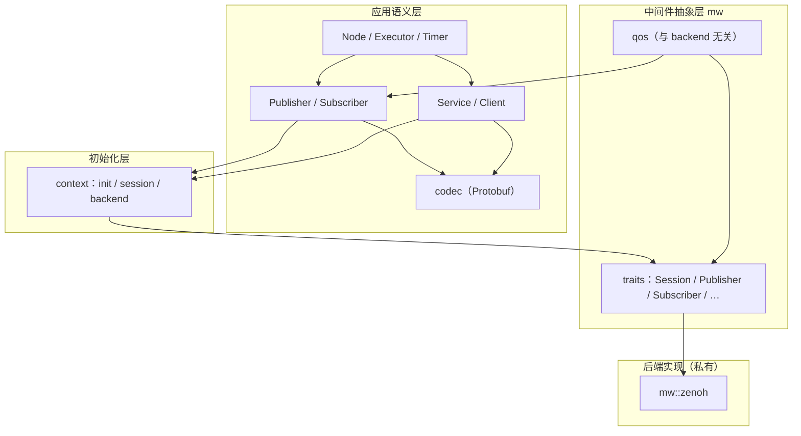

# zos-runtime

[ZeroOS](https://github.com/zero-robotic/zeroos) 通信运行时：**试验性**实现，用于摸索 ROS 2 风格的节点与中间件抽象，**非生产可用**。

提供 **Node**、发布/订阅、**Service** / **Client**、定时器与执行器；消息类型来自 [`zos-msg`](../msg/)（Protobuf）。API、分层与 backend 选型均可能随练习推进而调整，**不保证向后兼容**。

## 项目状态

| 项 | 说明 |
|----|------|
| **定位** | 个人练习 / 技术验证，非正式发布的产品级 runtime |
| **成熟度** | 可跑通示例与基础 pub/sub、service；缺 Parameter、Lifecycle 等 ROS 能力 |
| **稳定性** | 接口与模块划分可能重构；升级前请阅读 commit / PR |
| **backend** | 仅 [Zenoh](https://zenoh.io/)；`mw` trait 层为后续换 backend 预留，尚未验证多 backend 并存 |
| **测试** | 单元测试以 namespace 解析为主；集成与压力测试不足 |

若用于学习或本地联调可参考下文；若用于生产或对外交付，请自行评估风险。

## 架构分层

`zos-runtime` 在**同一 crate** 内分为三层，自上而下依赖，下层不感知 ROS 语义：



### 各层职责

| 层 | 目录 | 对外可见 | 职责 |
|----|------|----------|------|
| **应用语义** | `node`、`publisher`、`subscriber`、`service`、`client`、`executor`、`timer`、`codec` | 是（crate 公共 API） | ROS 2 风格 Node / 端点 / Executor；`zos-msg` Protobuf 编解码 |
| **初始化** | [`context`](src/context.rs) | 是 | 进程级 `init`、[`MiddlewareBackend`](src/context.rs) 选择、全局 `Arc<dyn Session>` |
| **中间件抽象** | [`mw`](src/mw/) | 部分（trait 与 QoS；`zenoh` 子模块私有） | 与传输无关的 `Session` / 端点 trait、[`MwError`](src/mw/error.rs) |
| **后端实现** | [`mw::zenoh`](src/mw/zenoh/) | 否（`pub(crate)`） | [Zenoh](https://zenoh.io/) 对 trait 的具体实现；仅 [`context`](src/context.rs) 调用 `open_default` / `open_from_file` |

默认 backend 为 **Zenoh**。应用代码只调用 `init()` 与 `Node`，**不**直接 `use zenoh::…`。

### 目录结构

```
src/
├── context.rs          # 唯一选择 backend、持有全局 Session
├── codec.rs            # zos-msg Protobuf encode / decode
├── node.rs             # Node、namespace、resolve_name
├── publisher.rs        # 类型化 Publisher（T: Message）
├── subscriber.rs       # 类型化 Subscriber + Runnable
├── service.rs          # Service + Runnable
├── client.rs           # Client（同步 call）
├── executor.rs         # 并发驱动 Runnable
├── timer.rs
├── qos.rs              # 对 mw::qos 的 re-export 门面
└── mw/
    ├── traits.rs       # Session, Publisher, Subscriber, Querier, Queryable
    ├── qos.rs          # PublishQos / SubscribeQos（无 Zenoh 类型）
    ├── error.rs
    └── zenoh/          # pub(crate)：session, publisher, subscriber, …
```

### 数据路径

**发布 / 订阅**（以 `Twist` 为例）：

1. `Publisher::publish(&msg)` → [`codec::encode`](src/codec.rs) → `Vec<u8>`
2. `context::session()` → `Arc<dyn Session>` → `declare_publisher` → `Box<dyn Publisher>`
3. `Publisher::put(bytes)` → 后端（Zenoh `put`）
4. 对端 `Subscriber::run` → `recv()` → `Vec<u8>` → `codec::decode` → 用户回调

**Service / Client**：

1. `Client::call`：encode 请求 → `Querier::get` → decode 响应
2. `Service::run`：`Queryable::recv` → `IncomingQuery` → handler → `query.respond`

中间件 trait 只传递 **`Vec<u8>`**；消息类型与 Protobuf 留在应用语义层。

### 封装约定

- **Node 与端点** 持有 `Arc<dyn Session>` 或 `Box<dyn Publisher / Subscriber / …>`，字段类型不出现 `zenoh::Session`。
- **`mw::zenoh`** 为 `pub(crate) mod`，库外 crate 无法引用 Zenoh 实现细节。
- **Backend 接线** 集中在 `context::open_backend`；新增 backend 时扩展 [`MiddlewareBackend`](src/context.rs) 并在该函数 `match` 分支挂载。
- **QoS** 定义在 `mw::qos`（`MessagePriority`、`Reliability`、`SubscriptionOrigin` 等）；`qos.rs` 仅 re-export，Zenoh 映射在 `mw::zenoh::qos`。

### 同进程投递

多个 `Node` 共享 [`init`](src/context.rs) 打开的**同一** `Session` 时，Zenoh 在 session 内做 topic 匹配并投递到订阅方队列（session-local），不经网卡。详见 Zenoh `Locality` / [`SubscribeQos::origin`](src/mw/qos.rs)。

## 依赖

在 workspace 或其它 crate 的 `Cargo.toml` 中：

```toml
zos-runtime = { path = "../runtime" }  # 或 workspace 依赖名
tokio = { version = "1", features = ["rt-multi-thread", "macros"] }
```

应用代码需要 Tokio 运行时（`#[tokio::main]`）。

## 初始化

进程内先调用一次 [`init`](src/context.rs) 打开全局中间件 session，再创建任意个 [`Node`](src/node.rs)（共享同一 session，类似 ROS 2 `rclcpp::init`）：

```rust
use zos_runtime::{init, init_from_file, init_with, MiddlewareBackend, RuntimeError};

#[tokio::main]
async fn main() -> Result<(), RuntimeError> {
    init().await?;
    // 或 init_with(MiddlewareBackend::Zenoh).await?;
    // 或 init_from_file("zenoh.json5").await?;  // Zenoh JSON5 配置
    Ok(())
}
```

## 快速开始

```rust
use zos_msg::Twist;
use zos_runtime::{init, Executor, Node, NodeOptions, RuntimeError};

#[tokio::main]
async fn main() -> Result<(), RuntimeError> {
    init().await?;
    let mut node = Node::new(NodeOptions::new());

    node.create_subscriber_builder::<Twist>("cmd_vel")
        .register(|msg| async move {
            println!("linear = {}", msg.linear);
        })?;

    let publisher = node.create_publisher::<Twist>("cmd_vel").build().await?;
    publisher.publish(&Twist { linear: 1.0, angular: 0.0 }).await?;

    Executor::spin_node(&mut node).await
}
```

带 **namespace** 的节点（与 ROS 2 `__ns` 一致）：

```rust
init().await?;
let mut node = Node::new(
    NodeOptions::new()
        .name("server")
        .namespace("/demo"),
);

node.create_service_builder::<Req, Resp>("scale")
    .register(|req| async move { Ok(resp) })?;
```

## 核心类型

| 类型 | ROS 2 对应 | 说明 |
|------|------------|------|
| [`init`](src/context.rs) | `rclcpp::init` | 默认配置，每进程一次 |
| [`init_from_file`](src/context.rs) | 带配置 init | JSON5 配置文件路径 |
| [`session`](src/context.rs) | — | 全局 `Arc<dyn Session>`（[`init`](src/context.rs) 后按需 clone） |
| [`Node`](src/node.rs) | `rclcpp::Node` | 创建端点、收集 runnable |
| [`NodeOptions`](src/node.rs) | node 选项 | `name`、`namespace`（默认 `/`） |
| [`Publisher`](src/publisher.rs) | `Publisher` | 话题发布 |
| [`Subscriber`](src/subscriber.rs) | `Subscription` | 话题订阅，可注册进 executor |
| [`Service`](src/service.rs) | `Service` | 请求/响应服务端 |
| [`Client`](src/client.rs) | `Client` | 请求/响应客户端 |
| [`Timer`](src/timer.rs) | `Timer` | 周期或单次定时 |
| [`Executor`](src/executor.rs) | executor | 并发驱动已注册的 `Runnable` |

各类型配有 **Builder**（如 `PublisherBuilder`），由 `Node::create_*` 返回；实现位于对应源文件。

## 命名（namespace）

与 ROS 2 相同，由 [`resolve_name`](src/node.rs) 解析：

- **相对名** `scale` → `{namespace}/scale`（根 namespace 下即为 `scale`）
- **绝对名** `/demo/scale` → 始终为 `demo/scale`，**忽略**当前节点的 namespace
- **节点名** `NodeOptions::name` 仅作标识，**不会**拼进话题或服务路径

跨 namespace 调用服务时使用绝对名，例如 `create_client("/demo/scale")`。

## Executor 与线程池

注册 subscriber / timer / service 后，由 [`Executor`](src/executor.rs) 驱动：

```rust
use zos_runtime::{Executor, ExecutorOptions};

init().await?;
let mut node = Node::new(NodeOptions::new());
// ... register runnables on node ...

// 使用 #[tokio::main] 的线程池（默认）
Executor::spin_node(&mut node).await?;

// 专用 n 线程池
Executor::spin_node_with(&mut node, ExecutorOptions::new().worker_threads(2)).await?;
```

| `ExecutorOptions::worker_threads` | 行为 |
|-----------------------------------|------|
| `None` | 当前 Tokio runtime（由 `#[tokio::main(worker_threads = N)]` 决定） |
| `Some(n)` | 独立 `n` worker 线程池 |

多节点时手动组装：`Executor::new(opts)` → `add_node`（可多次）→ `spin().await`。

## 示例

详见 [`examples/README.md`](examples/README.md)。

```bash
cargo run -p zos-runtime --example pub_sub
cargo run -p zos-runtime --example executor
cargo run -p zos-runtime --example service
cargo run -p zos-runtime --example client
```

## 测试

```bash
cargo test -p zos-runtime
```

当前单元测试覆盖 namespace / 名称解析逻辑（`node` 模块）。

## 规划（试验方向，非承诺）

以下为练习时可能探索的方向，**不保证实现或时间表**：

- `Parameter`、`Logger`、`Lifecycle`（见 [`src/lib.rs`](src/lib.rs) 顶部注释）
- 同进程 InProcess backend（绕过 Zenoh，降低延迟）
- 与仿真 / viz 的 Runtime 联调（`cmd_vel`、里程计、激光等）
- QoS 与跨进程传输的更多验证

欢迎 issue / PR，但请接受当前仓库以**个人摸索**为主、合并节奏与标准随练习变化。
